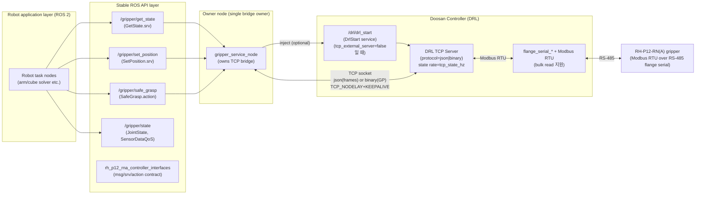
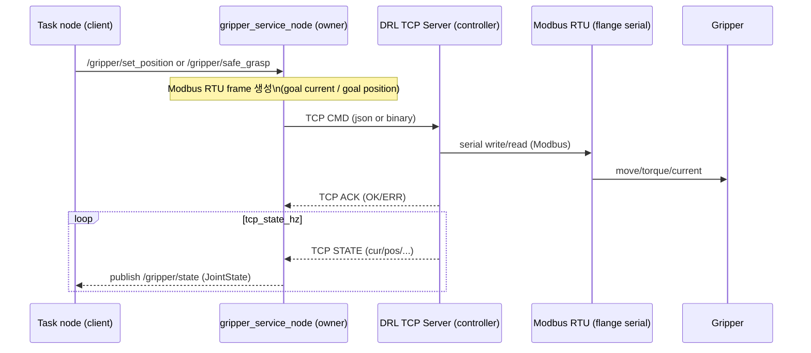

# RH‑P12‑RN(A) Controller (README)

이 문서는 `rh_p12_rna_controller`의 **최신 구조**(interfaces 패키지 분리 + owner 노드 + SafeGrasp + JSON/Binary TCP 옵션)를
다른 사람이 바로 이해하고 실행할 수 있도록 정리한 “운용 가이드”입니다.

---

## 0) 패키지 구성(왜 2개인가?)

현재는 **두 개 패키지가 세트로 움직입니다.**

### A) `rh_p12_rna_controller_interfaces`
- **역할**: ROS 통신 “규격(계약/Contract)”만 정의
- **포함(타입 정의)**:
  - `msg/GripperState.msg`
  - `srv/GetState.srv`
  - `srv/SetPosition.srv`
  - `action/SafeGrasp.action`

> 장점: 내부 구현(TCP/DRL/Modbus)이 바뀌어도 상위 노드는 API 계약만 보고 그대로 사용 가능.

### B) `rh_p12_rna_controller`
- **역할**: 실제 구현(Doosan DRL 주입, TCP 연결, Modbus RTU 프레임, 상태 publish, grasp 판정 등)
- **실행 노드**:
  - `gripper_service_node` (**권장 / TCP owner**)
  - `gripper_node` (기존 올인원 / 호환 목적)

---

## 1) 현재 구조 도식화 (권장 운용: `gripper_service_node`만 TCP owner)



---

## 2) 구성요소 상세 설명

### A) 상위 로봇 태스크 노드(TASK)
- 그리퍼 제어를 직접 TCP/DRL로 하지 않고, **ROS 서비스/액션으로만 요청**합니다.
- 예:
  - “현재 상태 1번 읽기” → `/gripper/get_state`
  - “목표 위치로 이동” → `/gripper/set_position`
  - “안전 파지(닫기+전류 판정)” → `/gripper/safe_grasp`

### B) API 계층(interfaces 패키지)
- `rh_p12_rna_controller_interfaces`가 제공하는 타입이 “사용자/상위노드”의 기준이 됩니다.
- 내부 구현이 JSON→binary로 바뀌거나, watchdog이 바뀌어도 API는 유지됩니다.

### C) Owner 노드: `gripper_service_node`
- **TCP 연결을 오직 이 노드가 소유**합니다 (Owner model).
- 제공:
  - `/gripper/get_state` (srv)
  - `/gripper/set_position` (srv)
  - `/gripper/safe_grasp` (action)
  - `/gripper/state` (topic publish)

> 주의: 동시에 다른 노드가 TCP를 잡으면(예: `gripper_node`를 또 실행) 프로토콜/포트가 꼬일 수 있습니다.

### D) 컨트롤러(DRL) TCP 서버
- `tcp_external_server=false`:
  - owner 노드가 `/drl/drl_start`로 DRL 코드를 **주입(inject)**하여 TCP 서버를 띄움
- `tcp_external_server=true`:
  - 컨트롤러에서 DRL TCP 서버를 **상시 실행**해 두고, ROS 노드는 접속만 함 (주입 오버헤드 감소)

### E) TCP 프로토콜 선택
- `tcp_protocol=json` (기본)
  - 길이(2B)+JSON 프레임
  - 디버깅/가시성 좋음
- `tcp_protocol=binary`
  - `GP` 헤더 + 바이너리 payload
  - JSON 파싱/직렬화 비용 감소 → 지연/지터 개선 가능

#### E-1) JSON 프레이밍 (현재 구현)
- **Frame**: `[len_hi][len_lo] + JSON(utf-8)`
- **PC → DRL (cmd)** 예시:
  - `{"type":"cmd","id":123,"frames":["010600...","011000..."]}`
- **DRL → PC (ack/state)** 예시:
  - `{"type":"ack","id":123,"ok":true,"err":""}`
  - `{"type":"state","cur":3,"pos":420,"gcur":300,"gpos_lo":420,"gpos_hi":0,...}`

#### E-2) Binary 프레이밍 (GP)
binary 모드에서는 브리지 비교 프로젝트처럼 **고정 헤더 + payload**를 사용합니다.

- **Header(struct)**: `>2sBBHH`
  - `magic(2B)="GP"`
  - `ver(1B)=1`
  - `type(1B)`:
    - `PING=1, PONG=2, CMD=3, ACK=4, STATE=5, STOP=6`
  - `seq(2B)`:
    - `CMD/ACK`의 상관관계 ID (PC cmd_id로 사용)
  - `payload_len(2B)`

- **CMD payload**
  - `[num_frames u16] + 반복([frame_len u16] + frame_bytes)`
  - frame_bytes는 Modbus RTU 패킷 raw bytes

- **ACK payload**
  - `[ok u8][err_len u16][err_bytes]`

- **STATE payload**
  - `>hi hHH` (big endian)
  - `cur(i16), pos(i32), gcur(i16), gpos_lo(u16), gpos_hi(u16)`

### F) 상태 토픽 QoS (왜 SensorDataQoS인가?)
`/gripper/state`는 센서/텔레메트리 스트림이므로 “최신값”이 중요합니다.  
Reliable로 쌓아두면 네트워크/처리 지연 시 **오래된 상태를 늦게 받는** 상황이 생깁니다.  
그래서 BestEffort(SensorDataQoS)를 사용해, 밀리면 드롭하고 **최신 상태로 복귀**하도록 합니다.

---

## 2.5) TCP 모드 시퀀스 (cmd → ack → state)



---

## 2.6) Owner 노드 내부(성능 관련 포인트)

- **Single owner**: TCP 소켓은 `gripper_service_node` 하나만 소유(충돌 방지)
- **`tcp_state_hz`**: 컨트롤러 state 송신 주기(너무 높이면 Modbus 부하↑)
- **`state_hz`**: ROS 토픽 `/gripper/state` publish 주기
- **QoS**: `/gripper/state`는 SensorDataQoS(BestEffort)로 큐 밀림/지연 완화
- **Keepalive/NoDelay**: TCP_NODELAY + SO_KEEPALIVE로 지연/끊김 완화

---

## 3) 레지스터 기본 맵 (RH‑P12‑RN(A), bridge_compare 기준)

- Goal:
  - `goal_current_reg = 275`
  - `goal_position_reg = 282`, `goal_position_regs = 2`
  - `goal_position_write_mode = fc16` (기본값)
- Present:
  - `present_current_reg = 287`
  - `present_position_reg = 290`, `present_position_regs = 2`
- 스케일:
  - `position_scale = 1.0` (만약 pulse*64로 관측되면 `position_scale:=64.0`)

---

## 4) 터미널 1/2/3/4 실행 명령어

> 아래는 예시 IP `110.120.1.40`, 포트 `9105` 기준입니다. 환경에 맞게 변경하세요.

### 터미널 1) Doosan bringup

```bash
source /opt/ros/$ROS_DISTRO/setup.bash
source /home/kimsungyeoun/ros2_ws/install/setup.bash

ros2 launch dsr_bringup2 dsr_bringup2_rviz.launch.py mode:=real model:=e0509 host:=110.120.1.40
```

### 터미널 2) 빌드 + `gripper_service_node` 실행 (TCP owner)

```bash
source /opt/ros/$ROS_DISTRO/setup.bash
cd /home/kimsungyeoun/cube-solver-with-DoosanE0509-ver1/src

colcon build --packages-select rh_p12_rna_controller_interfaces rh_p12_rna_controller
source install/setup.bash

ros2 run rh_p12_rna_controller gripper_service_node --ros-args \
  -p robot_ns:=dsr01 \
  -p command_transport:=tcp \
  -p tcp_external_server:=false \
  -p robot_ip:=110.120.1.40 \
  -p robot_port:=9105 \
  -p tcp_state_hz:=20.0 \
  -p state_hz:=20.0 \
  -p tcp_protocol:=json \
  -p gripper_command_action_enabled:=false \
  -p direct_cmd_topic_enabled:=false
```

> 바이너리로 돌리려면 `-p tcp_protocol:=binary`로 변경.

### 터미널 3) 서비스 호출 (상태/이동)

상태 1회 조회:

```bash
source /opt/ros/$ROS_DISTRO/setup.bash
cd /home/kimsungyeoun/cube-solver-with-DoosanE0509-ver1/src
source install/setup.bash

ros2 service call /gripper/get_state rh_p12_rna_controller_interfaces/srv/GetState "{}"
```

목표 위치 이동:

```bash
ros2 service call /gripper/set_position rh_p12_rna_controller_interfaces/srv/SetPosition \
"{position: 420, current: 300, timeout_sec: 5.0}"
```

### 터미널 4) SafeGrasp 액션 + 상태 토픽 모니터

SafeGrasp:

```bash
source /opt/ros/$ROS_DISTRO/setup.bash
cd /home/kimsungyeoun/cube-solver-with-DoosanE0509-ver1/src
source install/setup.bash

ros2 action send_goal /gripper/safe_grasp rh_p12_rna_controller_interfaces/action/SafeGrasp \
"{target_position: 420, goal_current: 300, current_threshold: 50, timeout_sec: 8.0}" --feedback
```

상태 토픽:

```bash
ros2 topic echo /gripper/state
```

---

## 5) 서비스/액션 존재 여부 확인(디버깅)

```bash
ros2 service list | grep /gripper/
ros2 action list | grep /gripper/

ros2 service type /gripper/get_state
ros2 service type /gripper/set_position
ros2 action info /gripper/safe_grasp
```

